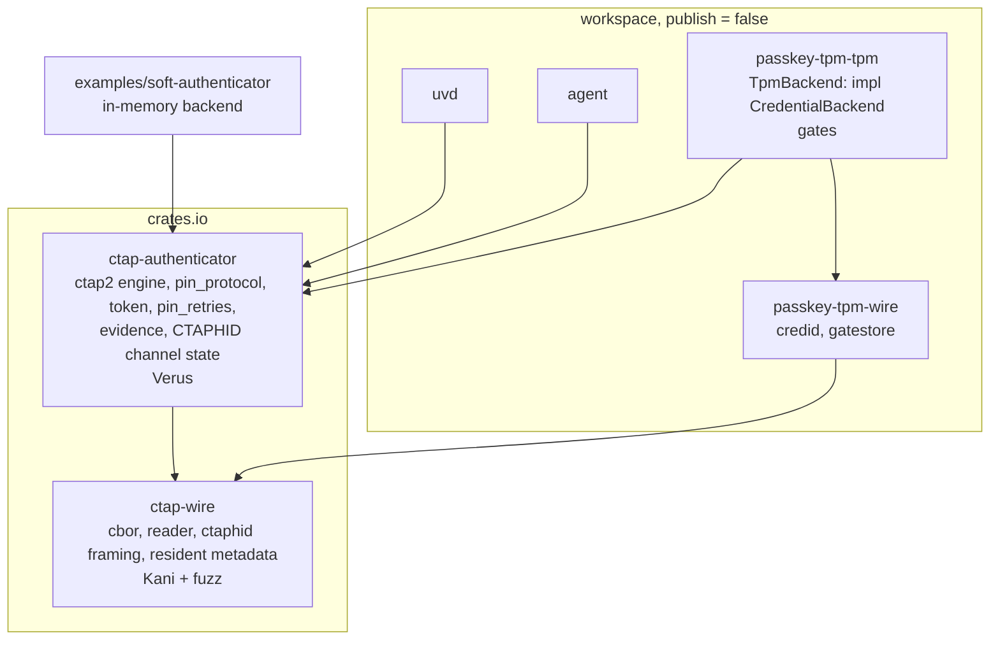

# Publish the CTAP 2.1 Core — Design

**Spec:** `.specs/features/ctap-crates/spec.md`
**Status:** Draft — assumes the recommended answers to C-G1..C-G5; revisit if Discuss changes them.

## Target layout



## Moves

| Today | Goes to | Notes |
|---|---|---|
| `wire::cbor`, `wire::reader` | `ctap-wire` | unchanged API |
| `core::ctaphid` packet framing/assembler | `ctap-wire::ctaphid` | channel/busy/keepalive state machine stays in the engine (Verus) |
| `wire::resident` | `ctap-wire::resident` | CTAP-generic discoverable-credential metadata; versioned format documented |
| `wire::credid`, `wire::gatestore` | `passkey-tpm-wire` (slimmed) | project-specific formats |
| `core::ctap2`, `pin_protocol`, `token`, `pin_retries`, `evidence` | `ctap-authenticator` | |
| `core::tpm_iface` | replaced by `ctap-authenticator::backend` | see trait below |
| `core::gates` (`GateKind`, `sign_allowed`, `hmac_uses_with_uv_key`) | split: credProtect rules → engine; TPM gate selection → `passkey-tpm-tpm` | `sign_allowed` is CTAP credProtect logic; `GateKind` naming is TPM-specific |

## Backend trait (sketch, to be refined in A3)

Generalises `TpmOps` (today: `verify_pin`, `pin_is_set`, `pin_retries`/`set_pin_retries`, `resident_entries`/`store_resident_entries`, `reset_user`, create/sign/hmac). The engine stays sync (`prepare` → `Step` → `complete`), so the trait is sync too.

```rust
pub trait CredentialBackend {
    type Error: core::fmt::Debug;
    /// Opaque per-principal identifier (passkey-tpm: unix uid).
    type Principal: Copy + Eq;

    fn create(&mut self, p: Self::Principal, req: &CreateRequest<'_>, uv: &UvEvidence)
        -> Result<CreatedCredential, BackendError<Self::Error>>;
    fn sign(&mut self, p: Self::Principal, cred: &CredentialRef<'_>, msg: &[u8], uv: &UvEvidence)
        -> Result<Signature, BackendError<Self::Error>>;
    fn hmac_secret(/* … */) -> Result<Option<HmacOutput>, BackendError<Self::Error>>;
    fn pin(&mut self) -> &mut dyn PinStore<Principal = Self::Principal>;      // verify/set/retries
    fn residents(&mut self) -> &mut dyn ResidentStore<Principal = Self::Principal>;
    fn reset(&mut self, p: Self::Principal) -> Result<(), BackendError<Self::Error>>;
}

#[non_exhaustive]
pub enum BackendError<E> { WrongPin, Lockout, Unavailable, NotFound, Other(E) }
```

`BackendError::{WrongPin, Lockout, Unavailable}` carries the distinction HARD-03 needs, so the hardening fix lands in the engine once.

## vstd (C-G2)

Plan (resolves B-003 if it works):

1. Feature `verus` (off by default) enables `vstd`; `verus!` blocks compile through a thin macro shim that erases `requires/ensures/proof` when the feature is off.
2. `cargo xtask verus` builds with the feature on; plain `cargo build` never sees `vstd`.
3. Spike first (A1): if the shim can't erase ghost code reliably, fall back to the exact pin and document it.

Uncertain: whether Verus's `verus!` macro supports an "erase" mode usable from stable rustc — verify in the spike before committing to (b).

## Publishing (CRATE-09/10)

- Tags `ctap-wire-v<semver>` and `ctap-authenticator-v<semver>` → `publish-crates.yml`: fast gate, `cargo publish -p <crate>` using crates.io Trusted Publishing (GitHub OIDC). Verify the current official auth action and its pin at task time; don't assume.
- PR CI: `cargo publish --dry-run -p ctap-wire -p ctap-authenticator` as an xtask step (`cargo xtask publish-check`).
- Each crate gets `readme`, `keywords` (`ctap`, `fido2`, `webauthn`, `passkey`, `authenticator`), `categories` (`authentication`, `cryptography`, `encoding`), `docs.rs` metadata.

## Risks

| Risk | Mitigation |
|---|---|
| Moving files breaks Verus proofs (module paths in specs) | Move first with no logic change (A2), run `cargo xtask verus` after each move |
| Kani harness paths / fuzz targets reference old crate names | Update in the same task as the move (A2) |
| Public API churn after publish | `0.1.0-alpha.N` until passkey-tpm 0.1.0 ships |
| `resident` format becomes a public compatibility promise | Keep the version byte; document migration policy |
