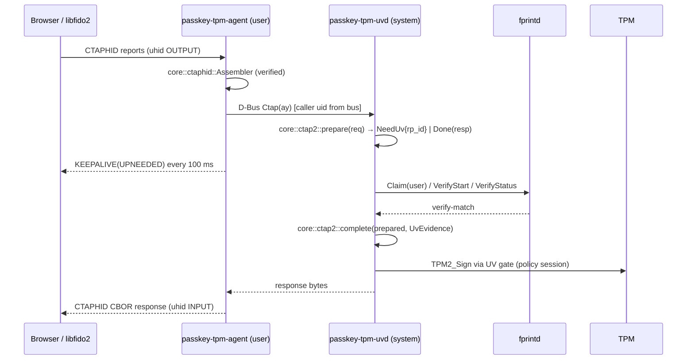

# MVP-1 Authenticator — Design

**Spec:** `spec.md` · **Status:** Approved (2026-10-03)

## Data flow

## Crate responsibilities and interfaces

### `passkey-tpm-wire`
- `cbor`: `Value { Uint(u64), Nint(u64) /* value = -1 - n */, Bytes(Vec<u8>), Text(String), Array(Vec<Value>), Map(Vec<(Value, Value)>), Bool(bool), Null }`.
  - `decode(&[u8]) -> Result<Value, CborError>` with limits `MAX_DEPTH = 4`, `MAX_ITEMS = 32` per array/map, input ≤ 2048 B; definite lengths only; no tags, no floats; rejects trailing bytes.
  - `encode(&Value) -> Vec<u8>` in CTAP2 canonical form (shortest heads; map keys sorted by encoded length, then bytewise).
- `credid`: v2 adds a 16-byte `tag` after the flags byte (MVP1-03).
- `gatestore`: v1 gains `cred_mac_key: AuthValue` (32 B), the per-user K_uid.

### `passkey-tpm-core`
- `ctaphid` (verified): parse a 64-byte report into `Init { cid, cmd, bcnt, data }` / `Cont { cid, seq, data }`; `Assembler` state machine (`Idle | Receiving { cid, cmd, total, buf, next_seq, deadline_ms }`) with `on_init`, `on_cont`, `on_tick` returning `Action::{None, Complete { cid, cmd, payload }, Error { cid, code }}`; `fragment(cid, cmd, payload) -> Vec<[u8; 64]>`.
  - **Verus invariants:** `buf.len() <= total <= MAX_MSG`; `Complete` only when `buf.len() == total`; continuation accepted only for the same cid and `seq == next_seq`; `next_seq <= 128`.
- `evidence` (verified): `UvEvidence` (private constructor, consumed by value) and `auth_data(rp_id_hash, ev: &UvEvidence, attested: Option<&[u8]>) -> Vec<u8>`, with ensures on the flags byte (UV bit ⇔ evidence present, AT ⇔ attested).
- `ctap2`: `Authenticator<T: TpmOps>`, with a two-phase API so the core stays synchronous and pure:
  - `prepare(&mut self, uid, req: &[u8]) -> Step`, where `Step::Done(Vec<u8>)` or `Step::NeedUv(Pending)`, and `Pending` carries the parsed request and the RP id for the prompt.
  - `complete(&mut self, uid, pending: Pending, outcome: UvOutcome) -> Vec<u8>`, where `UvOutcome::{Matched(UvEvidence), NoMatch, Cancelled, TimedOut, Unavailable}`.
  - `UvEvidence` can only be built by `evidence::UvEvidence::from_fprintd_match(uid)`, which the broker calls only after fprintd reports `verify-match` for that uid.

### `passkey-tpm-tpm`
- `adapter::TpmBackend` implements `TpmOps` over a `Context`, a state dir and per-uid `GateStore`s (provisioned lazily; NV index = `NV_BASE + uid`).

### `passkey-tpm-uv`
- `fprintd::verify(conn: &zbus::Connection, username: &str, timeout: Duration, cancel: CancellationToken) -> UvResult` (`Match | NoMatch | Cancelled | TimedOut | Unavailable(String)`), plus `fprintd::has_enrolled(conn, username)`.
- `mock` (feature `mock`): an in-process fake `net.reactivated.Fprint` service for tests, with a scripted result.

### `passkey-tpm-transport-uhid`
- `UhidDevice::create(&DeviceParams) -> io::Result<Self>` (sends CREATE2; the first `read_event` returns `Start`), `read_event() -> io::Result<UhidEvent>` (`Start | Stop | Open | Close | Output(Vec<u8>) | GetReport | SetReport | Other`), `write_input(&self, &[u8])`, `try_clone_writer() -> UhidWriter`, destroy on drop. Host-endian byte-level encoding of `struct uhid_event` (kernel ABI), no `unsafe`. An `Output` with a wrong report type is an `InvalidData` error: the agent logs it and keeps reading.

### `passkey-tpm-uvd` (broker)
- tokio + zbus system-bus service; interface `io.github.dangerousplay.PasskeyTpm1`; `Ctap(ay) -> ay`, `Cancel()`.
- One `Authenticator` per process (TPM serialised by a mutex); uid from `GetConnectionUnixUser`; username via `getpwuid_r` (`nix`/`uzers` crate).

### `passkey-tpm-agent`
- Creates the uhid device, runs the Assembler, keepalives and notifications (`notify-rust`), and calls the broker.

## Decisions

| Decision | Choice | Rationale |
|---|---|---|
| CBOR | own minimal decoder/encoder in `wire` | small, Kani-provable, canonical output; ciborium is too large to prove and is slow to update |
| CTAP version | `FIDO_2_0` only | browsers then send `uv` as an option instead of requiring pinUvAuthToken; hmac-secret is not mandatory |
| Gesture | fingerprint for every operation | one gate (UV), simplest secure MVP; presence-only arrives with MVP-2 |
| Recognising own credentials | HMAC tag with per-user K_uid | needed for excludeList and to avoid gesture-then-fail; the TPM still enforces |
| Async | tokio + zbus only in the shell crates | the core stays sync (Verus) |
| D-Bus prefix | `io.github.dangerousplay` | pending owner confirmation; one constant |
