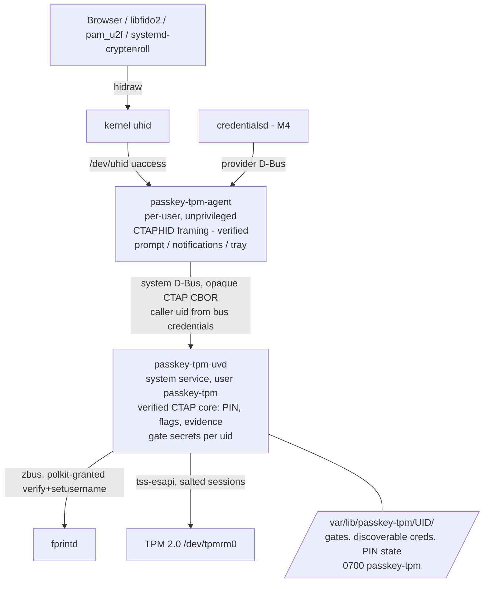

# TPM Policy Model — Design (incl. ADR-003)

**Spec:** `.specs/features/tpm-policy-model/spec.md`
**Research:** `.specs/features/tpm-policy-model/research.md`
**Status:** Approved (2026-10-03)

---

## ADR-003: Privileged broker + per-user PolicyOR of PolicySecret gates

**Status:** Accepted (2026-10-03)

**Context:** Software-only UV gating (Go) lets T1 and T2 sign with any credential ID. TPM policy can enforce *that a secret was presented*. It can't enforce *that a finger was matched*, because fprintd results are not attested to the TPM. The process that holds the gate secrets therefore becomes the UV enforcement point, and it has to run under a different uid from the user.

**Decision:**
1. Split the system into a privileged **broker** `passkey-tpm-uvd`, the sole holder of gate secrets, and an unprivileged per-user **agent** `passkey-tpm-agent` (transport and UI).
2. Every credential key's authPolicy = `PolicyOR(P_pin, P_uv, P_up)`, where `P_x = PolicyCommandCode(cc) ; PolicySecret(gate_x[uid].Name, policyRef = SHA-256(tag_x ‖ rpIdHash))`.
3. Gates are **per user**:
   - PIN gate = NV index, DA-protected, authValue = Argon2id(pinHash16, salt); changed with `NV_ChangeAuth`.
   - UV and UP gates = keyedHash objects, `noDA`, with 32-byte random authValue.
4. hmac-secret uses two keyedHash HMAC keys per credential (WithUV: `PolicyOR(P_pin, P_uv)` on `TPM2_HMAC`; WithoutUV: `P_up` on `TPM2_HMAC`).
5. Persistent TCG SRK at 0x81000001 with its Name pinned. Salted, parameter-encrypted policy sessions.
6. The signature counter is always 0.

**Alternatives rejected:**
- **M1 (PIN authValue on each key):** a PIN change leaves the old blobs (already held by RPs) unlocking with the old PIN, and fingerprint can't be supported.
- **M2 (user-daemon-held gate):** same uid as T2.
- **M3a (PolicySigned):** with a sole broker it adds an in-TPM asymmetric verify per assertion for no extra security, and it needs `tr_sess_get_nonce_tpm` (8.0-alpha only).
- **M3b (DAC only):** fails once any other process gets tss access (ssh-tpm-agent, tpm2-pkcs11).

**Consequences:**
- (+) T1, T4 and T5 are enforced by the TPM. T2 needs a physical gesture or knowledge of the PIN.
- (+) PIN changes are cheap and don't invalidate credentials.
- (−) A system service, polkit rules for fprintd and a dedicated system user are needed. Users no longer need the `tss` or `plugdev` groups.
- (−) NV indexes per user need ownerAuth at provisioning when an admin has set it. NV space is small, about 3 indexes per user.
- (−) DA is global: T1 can lock out the PIN path for everyone by failing auth on their own DA objects. UV/UP gates are `noDA`, so fingerprint keeps working.
- (−) T3 on the UV path: the UV/UP gate secrets are root-only files, so full-disk encryption is required. PCR-bound gates are deferred.
- (−) tss-esapi 7.7.0 lacks the DA commands and `NV_ChangeAuth`, so a small audited `tss-esapi-sys` FFI module is needed until 8.0 is stable.

---

## Architecture



**Placement rules:**
- The **verified CTAP core runs in the broker.** PIN retries, pinUvAuthToken, UP/UV evidence and auth-data construction must not be in the reach of T2.
  - clientPIN ECDH runs between the platform and the broker, so the agent only forwards ciphertext and never sees the PIN.
- The **agent** owns only the transport (CTAPHID, verified separately) and the UI. It is untrusted for security decisions.
- The **caller uid** comes from D-Bus `GetConnectionCredentials` (UnixUserID) and is never taken from the payload.

---

## Components

### `passkey-tpm-core` (verified, sync, `forbid(unsafe_code)`)

- **Purpose:** CTAP 2.1 state machine and policy decisions.
- **Interfaces:**
  - `fn handle(state: &mut AuthnState, req: CtapRequest, env: &mut impl Platform) -> CtapResponse`
  - `trait Platform { fn tpm(&mut self) -> &mut impl TpmOps; fn uv(&mut self, rp: &RpId, kind: UvKind) -> Result<UvEvidence, UvError>; ... }`
  - `UvEvidence` is a linear token, constructible only in the `uv` module. `sign_assertion(..., ev: UvEvidence)` consumes it.
- **Verus obligations:**
  - Flags UV=1 ⇒ `ev.kind ∈ {Pin, Fingerprint}`.
  - The gate requested from the TPM matches `ev.kind`.
  - PIN retries: decremented before compare, blocked at 0, reset only on success.
  - getNextAssertion is bound to its channel and expires.

### `passkey-tpm-tpm` (shell, trusted)

- **Purpose:** TPM operations behind the `TpmOps` trait.
- **Interfaces:**
  - `provision(uid) -> GateSet`
  - `create_credential(uid, rp_id_hash, protect: CredProtect) -> CredBlobs`
  - `sign(uid, blobs, rp_id_hash, gate: GateKind, digest) -> Signature`
  - `hmac(uid, blobs, rp_id_hash, with_uv: bool, gate: GateKind, salt) -> [u8; 32]`
  - `change_pin(uid, old, new)`
  - `health() -> SrkStatus`
- **Reuses:** tss-esapi 7.7; `ffi.rs` (tss-esapi-sys) for `NV_ChangeAuth` and `DictionaryAttack*` only, with `unsafe` confined there.

### `passkey-tpm-uv` (shell)

- **Purpose:** UV providers.
  - `FprintdProvider`: zbus proxy; Claim(username), VerifyStart, VerifyStatus, and a check that the signal sender equals the owner of `net.reactivated.Fprint`.
  - `PresenceProvider`: a gesture through the agent's prompt.
- PIN is not a provider: it's part of the core clientPIN logic, which yields `UvEvidence::Pin`.

### `passkey-tpm-uvd` (broker daemon)

- systemd system service, `User=passkey-tpm`, `SupplementaryGroups=tss`, plus hardening (`ProtectSystem=strict`, `StateDirectory=passkey-tpm`, `DeviceAllow=/dev/tpmrm0`, `RestrictAddressFamilies=AF_UNIX`, `SystemCallFilter=@system-service`).
- D-Bus system bus name `<prefix>.PasskeyTpm1`, with a bus policy so only `passkey-tpm` can own it.
- polkit rule: grant `net.reactivated.fprint.device.verify` + `setusername` to the `passkey-tpm` user only.

### `passkey-tpm-agent` (per-user)

- systemd user service. uhid via the udev `uaccess` tag (no group).
- Verified CTAPHID framing.
- Prompts (RP ID shown), tray, and the YubiKey/physical-key auto-switch.

---

## Data model

**Credential ID (non-discoverable), version 1:**
```
u8   version = 1
u8   flags         (credProtect level, has_hmac)
u16  len ‖ TPM2B_PUBLIC  cred_key
u16  len ‖ TPM2B_PRIVATE cred_key
u16  len ‖ TPM2B_PUBLIC  hmac_uv      (optional)
u16  len ‖ TPM2B_PRIVATE hmac_uv      (optional)
u16  len ‖ TPM2B_PUBLIC  hmac_nouv    (optional)
u16  len ‖ TPM2B_PRIVATE hmac_nouv    (optional)
```
- rpIdHash is not stored; it's supplied by the request and enforced by the policy.
- uid is not stored; it comes from the caller and is enforced by the per-user gate Name inside the authPolicy.
- Target ≤ 1023 B; measure in M1 (estimate ≈ 700 B). If it's too large, drop the hmac keys from the ID and derive them from a per-user HMAC key with policyRef binding (fallback, needs a new ADR).

**Per-user state** `/var/lib/passkey-tpm/<uid>/`:
- `gates.v1` (UV/UP gate blobs + authValues, PIN NV index handle, Argon2 salt)
- `pin.v1` (retries, set flag, minPinLength)
- `resident/` (discoverable credential metadata + blobs)

All writes are atomic.

---

## Flows

**Register:**
1. The agent forwards makeCredential.
2. The core requires evidence (UV or UP per options).
3. `create` cred_key with authPolicy computed **offline** from the gate Names + rpIdHash (`policy_get_digest` on a trial session, or computed in software and asserted equal in tests).
4. Optionally `create` hmac_uv / hmac_nouv.
5. Build the credential ID and return attestation `none`.

**Assert:**
1. Load cred_key.
2. The core obtains `UvEvidence` (fprintd / PIN token / presence).
3. Start a salted policy session on the SRK with AES-128-CFB.
4. `PolicyCommandCode(Sign)`.
5. Load gate_x[uid] and `tr_set_auth`.
6. `PolicySecret(gate, policyRef(x, rpIdHash))`.
7. `PolicyOR(branches)`.
8. `Sign(SHA-256(authData ‖ cdh))`.
9. hmac-secret: repeat with `CommandCode::Hmac` on hmac_uv / hmac_nouv.
10. Flush everything.

**PIN change:** clientPIN changePIN → the core verifies the old pinHash → `NV_ChangeAuth(pin_gate, Argon2id(newPinHash16, salt))`. No credential blob changes.

---

## Error handling

| Scenario | Handling | User impact |
|---|---|---|
| SRK missing or Name mismatch | `CTAP2_ERR_NOT_ALLOWED` + health status = reset | Notification: "TPM was reset — passkeys on this device are no longer usable" |
| TPM in DA lockout | PIN path returns `CTAP2_ERR_PIN_AUTH_BLOCKED`; UV path still works | Message showing the recovery time |
| fprintd busy (claimed by GDM/lock screen) | Retry with backoff, then fall back to PIN if set | Prompt "fingerprint reader busy" |
| Policy check fails (wrong uid or RP) | `CTAP2_ERR_NO_CREDENTIALS` (no oracle) | Same as unknown credential |
| Credential ID malformed | Parser rejects without panicking (Kani-proven) | `CTAP2_ERR_INVALID_CREDENTIAL` |

---

## Tech decisions

| Decision | Choice | Rationale |
|---|---|---|
| PIN gate storage | NV index + `NV_ChangeAuth` | No stale blob after a PIN change (TPM-09) |
| UV/UP gate storage | keyedHash objects, `noDA` | Cheap, high entropy, survive DA lockout |
| KDF | Argon2id over pinHash16 | systemd is moving to Argon2id; pinHash has low entropy |
| Session | Salted on SRK, AES-128-CFB, encrypt+decrypt | Protects authValue and HMAC output on a dTPM bus |
| Counter | 0 | WebAuthn "unsupported"; no NV wear |
| tss-esapi | 7.7 + minimal sys FFI; migrate to 8.0 when stable | 7.7 is packaged in Debian/Fedora |
| fprintd from a system service | polkit grant to the `passkey-tpm` user | `setusername` defaults to auth_admin_keep |

---

## Open risks (tracked in STATE.md)

1. **Trusted prompt:** the prompt shown by the agent is spoofable by T2, which could get a touch approved for a different RP. Mitigation: prompt from the broker via a polkit-agent-like channel or credentialsd-ui (M4). Feasibility UNVERIFIED.
2. **Global DA** is shared with LUKS and Windows dual-boot. Never take ownership of lockoutAuth silently (TPM-14).
3. **fprintd single claim** conflicts with GDM/PAM; needs testing on GNOME, KDE and the authd setup.
4. **Performance** numbers are not yet measured on AMD fTPM (TPM-17).
5. **CTAP spec citations** for pinHash16 and CredRandomWithUV/WithoutUV must be checked against the CTAP 2.1/2.2 text before implementation.
